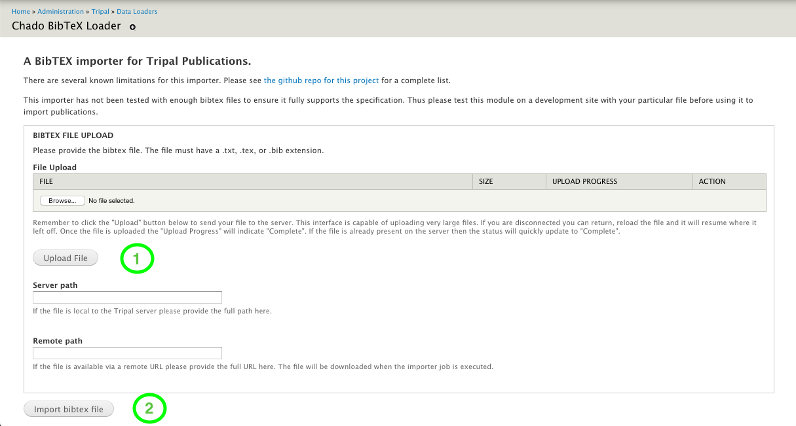

Usage
======

This module provides two methods to import publications in BibTeX format. See below for instructions specific to each one.

Importer
---------

Navigate to ``Administration Toolbar > Tripal > Data Loaders > Chado BibTeX Loader`` on your Tripal site. Upload your file and click "Load BibTeX file".

Drush
------

Navigate to your Drupal Root on the command-line (e.g. ``cd /var/www/html``) and run ``drush trpimport-bibtex /full/path/to/your/file.tex``
